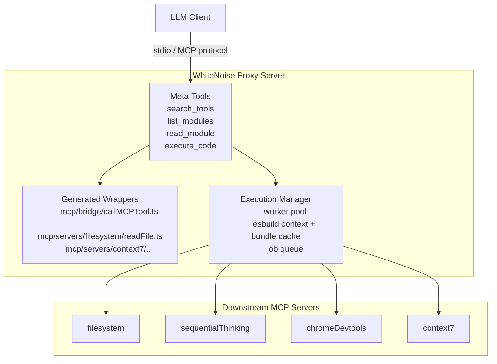
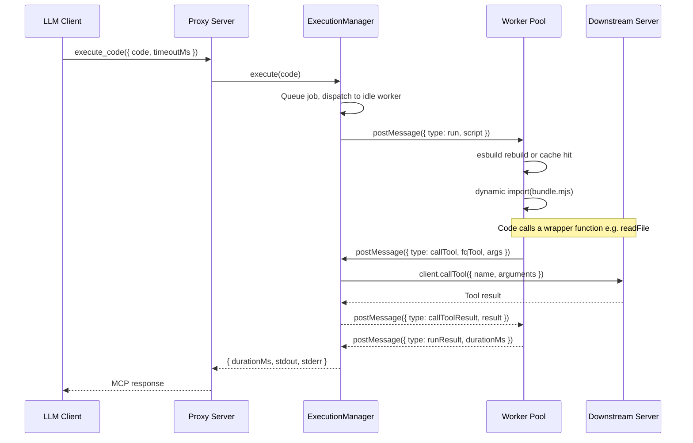
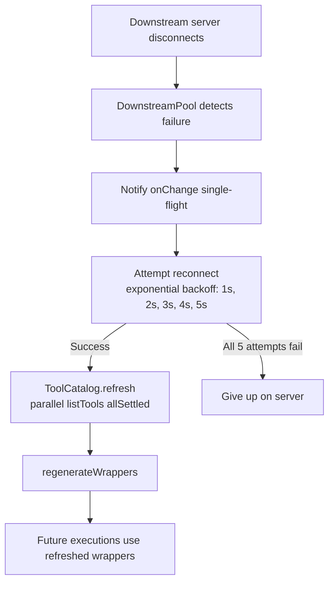

# WhiteNoise - Cut to the good part

An MCP (Model Context Protocol) proxy server that sits between an LLM client and multiple downstream MCP servers. Rather than exposing each downstream tool directly, WhiteNoise generates typed TypeScript wrapper modules on disk and exposes four meta-tools that let the LLM discover, inspect, and compose those wrappers into executable code.

## The Problem

Standard MCP integrations suffer from two bottlenecks:

1. **Context bloat** -- Every tool's name, description, and full input schema is injected into the LLM's context window on every request, even if only one or two tools are needed. With dozens of downstream servers this adds up fast.
2. **Round-trip chaining** -- When the LLM needs to pipe the output of one tool into another, each intermediate result must travel back through the model, burning tokens and introducing latency.

## How WhiteNoise Solves This

- **Lazy discovery**: Tool definitions live as TypeScript files in a temp directory. The LLM browses them through `list_modules` and `read_module` only when it needs them -- nothing is loaded into context upfront.
- **Code-level composition**: The LLM writes a single TypeScript snippet that imports multiple wrappers and chains calls directly. Intermediate values flow inside the worker thread without ever leaving the process.

**Benchmark result: an average of 84% token savings** versus vanilla MCP, measured across the multi-server orchestration scenarios in `dashboard/` (context-window schema injection + round-trip chaining combined).

```typescript
// One execute_code call replaces multiple round-trips:
import { readFile } from 'mcp/servers/filesystem/readFile';
import { writeFile } from 'mcp/servers/filesystem/writeFile';

const content = await readFile({ path: '/path/to/notes.json' });
const transformed = JSON.parse(content.content[0].text).map(/* ... */);
await writeFile({ path: '/path/to/output.json', content: JSON.stringify(transformed) });
```

## Architecture



## Getting Started

### Prerequisites

- Node.js 20+ (use Node 22 if you also run [MCP Inspector](TESTING.md#2-launch-with-mcp-inspector))
- npm

### Install

```bash
npm install
```

### Build

```bash
npm run build
```

### Run

```bash
npm start
```

The server communicates over **stdio** using the MCP protocol. Point any MCP-compatible client (Claude Desktop, Cursor, etc.) at the built binary (`dist/index.js`).

`npm start` boots the server with OpenTelemetry instrumentation (`--import ./dist/telemetry/instrumentation.js`). By default traces and metrics are exported to `http://localhost:4318`. If no OTLP collector is listening, the exporter logs a warning to stderr and the server keeps running — telemetry is non-blocking.

### Run with SigNoz

Start the observability stack, then run WhiteNoise:

```bash
# Start SigNoz (docker compose)
foundryctl cast -f observability/casting.yaml

# Run the proxy — telemetry auto-connects to SigNoz at localhost:4318
npm start
```

Traces and metrics appear under the `whitenoise` service in the SigNoz UI at `http://localhost:8080`. See [`observability/README.md`](observability/README.md) for environment variables, dashboards, and privacy defaults.

### Development

```bash
# Build and run in one step
npm run dev

# Unit + hermetic integration tests
npm test

# Unit tests only
npm run test:unit

# Real end-to-end (boots proxy + downstream servers)
npm run test:e2e

# Coverage over src/
npm run test:coverage
```

See [TESTING.md](TESTING.md) for the full automated suite, CI notes, and the manual MCP Inspector checklist.

## Configuring Downstream Servers

Edit [`src/downstream/servers.json`](src/downstream/servers.json) to add, remove, or change downstream MCP servers. Each entry has four fields:

| Field     | Type                           | Description                                       |
| --------- | ------------------------------ | ------------------------------------------------- |
| `name`    | `string`                       | Stable identifier used to namespace tools        |
| `command` | `string`                       | Executable to spawn (e.g. `npx`, `node`)          |
| `args`    | `string[]`                     | Arguments passed to the command                   |
| `env`     | `Record<string, string>` (opt) | Extra environment variables for the child process |

Use `"$PROJECT_ROOT"` in any `args` string to inject the absolute repo-root path at startup. The [`servers.ts`](src/downstream/servers.ts) file reads the JSON, validates every entry, and expands placeholders — no logic lives in the config.

The default configuration ships with four servers:

```json
{
  "servers": [
    {
      "name": "filesystem",
      "command": "npx",
      "args": ["-y", "@modelcontextprotocol/server-filesystem", "$PROJECT_ROOT"]
    },
    {
      "name": "sequentialThinking",
      "command": "npx",
      "args": ["-y", "@modelcontextprotocol/server-sequential-thinking"]
    },
    {
      "name": "chromeDevtools",
      "command": "npx",
      "args": ["-y", "chrome-devtools-mcp"]
    },
    {
      "name": "context7",
      "command": "npx",
      "args": ["-y", "@upstash/context7-mcp"]
    }
  ]
}
```

After editing, rebuild and restart. First boot may need npm registry access because servers are started with `npx -y`.

## Meta-Tools Exposed to the LLM

WhiteNoise presents exactly four tools to the connected LLM client:

### `search_tools`

Full-text search across every tool in the downstream catalog. Matches against tool name, fully-qualified name, and description with ranked scoring. Empty queries (and queries that score nothing) return a deterministic browse-style listing.

| Parameter | Type     | Required | Default | Description               |
| --------- | -------- | -------- | ------- | ------------------------- |
| `query`   | `string` | yes      | --      | Search term               |
| `limit`   | `number` | no       | 20      | Maximum number of results |

### `list_modules`

Recursively lists the generated TypeScript wrapper files under the wrappers directory. Accepts an optional sub-path to narrow the listing.

| Parameter | Type     | Required | Default | Description                       |
| --------- | -------- | -------- | ------- | --------------------------------- |
| `path`    | `string` | no       | `""`    | Sub-path within the wrappers tree |

Returns module specifiers like `mcp/servers/filesystem/readFile` and `mcp/servers/filesystem/readFile.schema`.

### `read_module`

Returns the full TypeScript source of a single wrapper module so the LLM can inspect the function signature, input types, field descriptions, and schema.

| Parameter   | Type     | Required | Description                                               |
| ----------- | -------- | -------- | --------------------------------------------------------- |
| `specifier` | `string` | yes      | Module specifier (e.g. `mcp/servers/filesystem/readFile`) |

### `execute_code`

Accepts a TypeScript snippet, bundles it with esbuild, and runs it in a Worker thread from a small pool. Any `mcp/*` imports are resolved to the generated wrappers, and tool calls inside the code are routed to the real downstream servers.

| Parameter   | Type     | Required | Default | Description                 |
| ----------- | -------- | -------- | ------- | --------------------------- |
| `code`      | `string` | yes      | --      | TypeScript source to execute |
| `timeoutMs` | `number` | no       | 30000   | Per-execution timeout in ms |

Returns `{ durationMs, stdout, stderr }` on success. Compile/runtime failures are returned as tool content (the proxy stays up).

## How Execution Works



1. The LLM submits TypeScript code via `execute_code`.
2. The `ExecutionManager` queues the job and assigns it to an idle worker in the pool.
3. The worker hashes the script (plus wrappers dir). On a cache miss it writes an entry file under `os.tmpdir()/meta-mcp-proxy/exec/`, rebuilds via a reused esbuild `context()`, and stores the bundle; on a hit it reuses the cached file.
4. The bundle is dynamically imported inside the worker (unique query string so top-level code re-runs).
5. When the code calls a wrapper (e.g. `readFile()`), the wrapper invokes `globalThis.__callMCPTool`, which messages the main thread.
6. The main thread parses the fully-qualified tool name, looks up the client in `DownstreamPool`, and forwards the call.
7. The downstream response flows back to the worker, where the wrapper's promise resolves.
8. When the script finishes (or times out), stdout/stderr are captured and returned. Workers are recycled after a configurable number of runs to reclaim the ESM module cache.

### Execution Safeguards

| Safeguard      | Value        | Description                                              |
| -------------- | ------------ | -------------------------------------------------------- |
| Soft timeout   | 30 s         | Configurable per call via `timeoutMs`                    |
| Hard timeout   | 60 s         | Absolute ceiling enforced inside the worker              |
| Worker pool    | up to 4      | Concurrent executions (sized from available parallelism) |
| Queue depth    | 50           | Maximum pending executions before rejecting              |
| Output cap     | 1 MB         | stdout and stderr are each truncated at 1 MB             |
| Worker recycle | every 50 runs | Reclaims leaked ESM module entries                      |
| Crash recovery | auto         | Worker crashes trigger respawn and queue processing      |

Wrappers and exec sandboxes live under `os.tmpdir()/meta-mcp-proxy/` (not inside the repo), so the filesystem downstream server cannot see or mutate execution scratch files.

## Wrapper Generation

At startup (and on hot reload), WhiteNoise queries every downstream server's tool list in parallel and generates two files per tool. Field descriptions and defaults from the raw JSON Schema are preserved as Zod `.describe()` / `.default()` calls; the tool description becomes JSDoc on the wrapper function.

**`<toolName>.schema.ts`** -- input schema as Zod:

```typescript
import { z } from 'zod';

export const ReadFileSchema = z.object({
  path: z.string().describe("Absolute path to the file to read"),
});
```

**`<toolName>.ts`** -- typed async function that calls the bridge:

```typescript
import { callMCPTool } from 'mcp/bridge/callMCPTool';
import type { z } from 'zod';
import { ReadFileSchema } from './readFile.schema';
import type { MCPResult } from 'mcp/bridge/callMCPTool';

export type ReadFileInput = z.infer<typeof ReadFileSchema>;
export type ReadFileOutput = MCPResult;

/** Read the contents of a file from disk */
export async function readFile(input: ReadFileInput): Promise<ReadFileOutput> {
  return callMCPTool('filesystem__read_file', input);
}
```

The **bridge module** (`mcp/bridge/callMCPTool.ts`) delegates to `globalThis.__callMCPTool`, which is injected by the worker before the bundle runs.

JSON Schema conversion covers common MCP patterns including `anyOf` / `oneOf` / `allOf`, local `$ref`, `additionalProperties`, and string/number constraints. Generation prefers emitting Zod source directly from JSON Schema rather than reflecting Zod internals.

## Hot Reload



When a downstream server disconnects:

1. The `DownstreamPool` detects the broken connection and fires `onChange` callbacks (async errors are contained).
2. Reconnection is attempted with exponential backoff (1 s … 5 s, up to 5 attempts).
3. Catalog refresh + wrapper regenerate are serialized behind a single-flight lock (latest-wins) so concurrent disconnects cannot corrupt the wrappers tree.
4. A single failing `listTools` does not abort refresh — that server is skipped and the rest of the catalog still loads.
5. Future executions pick up the refreshed wrappers.

Stray `uncaughtException` / `unhandledRejection` events are logged without taking down the proxy; only `SIGINT` / `SIGTERM` trigger a clean shutdown.

## Testing

| Command              | What it runs                                      |
| -------------------- | ------------------------------------------------- |
| `npm test`           | Unit + hermetic integration (Vitest)              |
| `npm run test:unit`  | Unit tests only (`src/` imports)                  |
| `npm run test:e2e`   | Real stdio proxy + downstream servers (`RUN_E2E`) |
| `npm run test:watch` | Vitest watch mode                                 |
| `npm run test:coverage` | Coverage over `src/`                           |

CI (`.github/workflows/ci.yml`) runs unit/integration on every push/PR and a separate e2e job with network access for `npx` downstream packages.

Full details, including the MCP Inspector manual checklist: **[TESTING.md](TESTING.md)**.

## Project Structure

```
src/
  index.ts                        Entry point — pool, catalog, wrappers,
                                  execution manager, MCP server, hot reload

  downstream/
    servers.json                  Human-editable downstream server list
    servers.ts                    JSON reader, validator, and placeholder resolver
    pool.ts                       Connection pool with auto-restart
    catalog.ts                    Aggregated tool catalog with search scoring
    names.ts                      Fully-qualified tool name helpers
    schemaConverter.ts            JSON Schema → Zod (runtime + source emit)

  telemetry/
    instrumentation.ts            OTel NodeSDK bootstrap (loaded before app code)
    tracing.ts                    Span helpers (withSpan, startChildSpan, etc.)
    metrics.ts                    Metric instruments (histograms, counters, gauges)
    errors.ts                     Error classification and model-facing payloads
    attributes.ts                 Span attribute constants and hashing helpers

  proxy/
    server.ts                     MCP server exposing the four meta-tools
    toolSchemas.ts                Zod input schemas for the meta-tools
    runtimeSchemas.ts             MCP success/error envelope types

  wrappers/
    manager.ts                    Wrapper lifecycle (prepare, regenerate, paths)
    generate.ts                   TypeScript code generation for wrappers + bridge
    modules.ts                    list_modules / read_module implementations

  exec/
    manager.ts                    Worker pool, job queue, timeouts, recycle
    worker.ts                     esbuild context, bundle cache, sandbox import
    protocol.ts                   Main ↔ Worker message types
    esbuildPlugin.ts              Resolves mcp/* imports

observability/                    SigNoz docker compose stack, dashboards, casting config
test/
  unit/                           Fast tests against src/
  integration/                    Hermetic tests against dist/ + fake pool
  e2e/                            Gated real-proxy stdio tests
  helpers/                        Fake pool, fixtures, build globalSetup
```

## Dependencies

| Package                                     | Purpose                                        |
| ------------------------------------------- | ---------------------------------------------- |
| `@modelcontextprotocol/sdk`                 | MCP client and server SDK                      |
| `@modelcontextprotocol/server-filesystem`    | Filesystem MCP server                          |
| `@modelcontextprotocol/server-sequential-thinking` | Structured reasoning MCP server        |
| `chrome-devtools-mcp`                       | Chrome DevTools protocol MCP server             |
| `@upstash/context7-mcp`                     | Library documentation lookup MCP server         |
| `zod`                                       | Schema validation and wrapper code generation   |
| `esbuild`                                   | Bundling user-submitted TypeScript             |
| `@opentelemetry/api`                        | OpenTelemetry API interfaces                   |
| `@opentelemetry/sdk-node`                   | Node.js OTel SDK bootstrap                     |
| `@opentelemetry/exporter-trace-otlp-http`   | OTLP/HTTP trace exporter                       |
| `@opentelemetry/exporter-metrics-otlp-http` | OTLP/HTTP metric exporter                      |
| `typescript`                                | Type checking and compilation (dev)            |
| `vitest`                                    | Test runner (dev)                              |

## License

MIT
