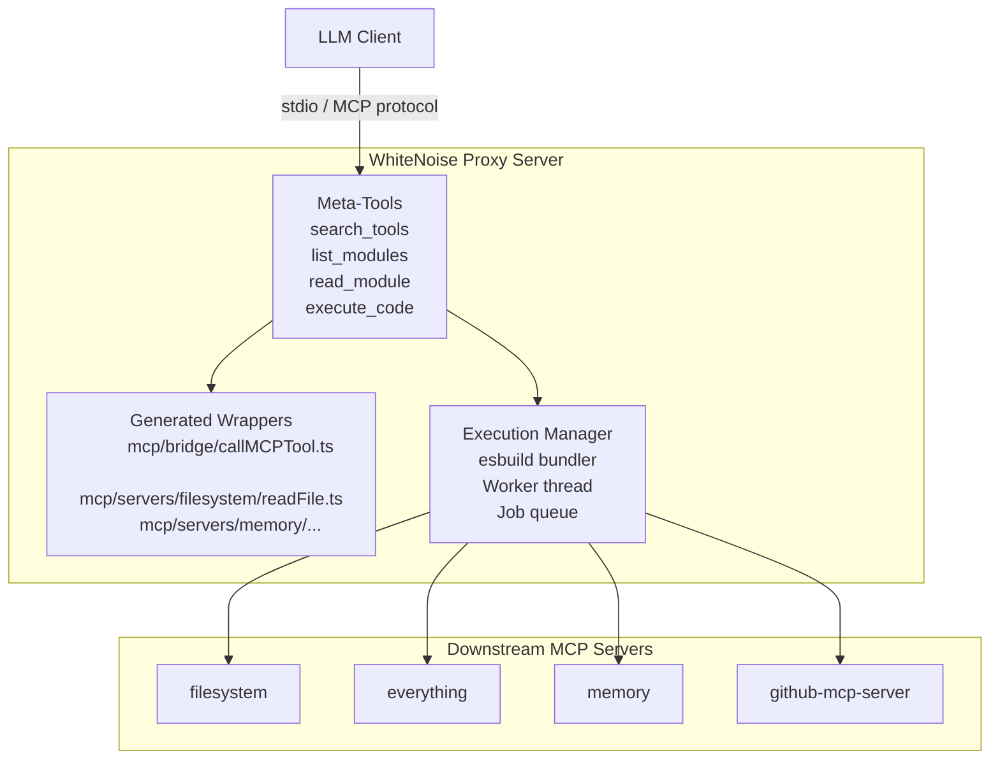
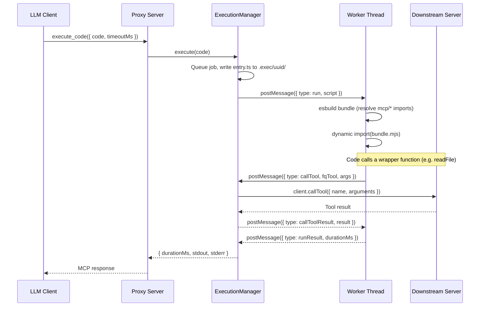
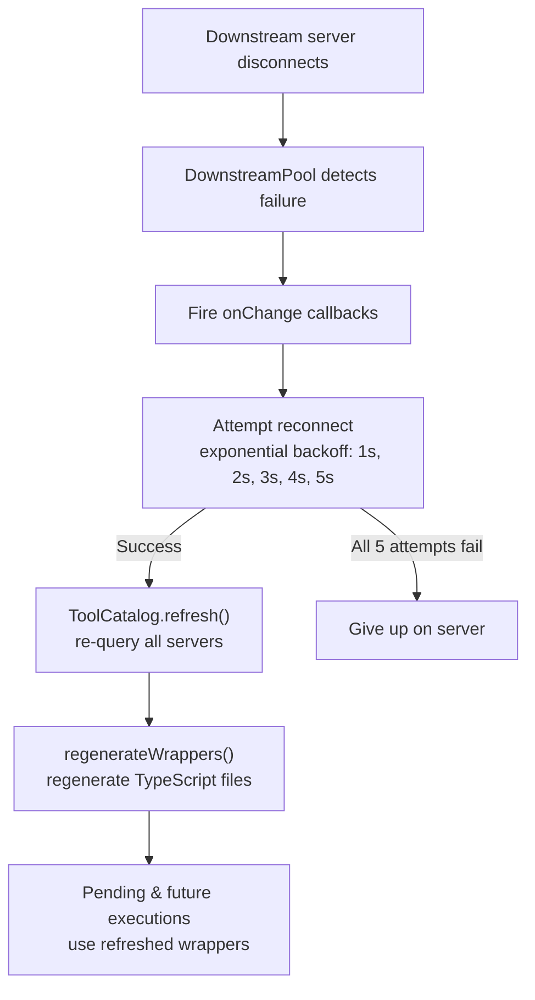

# WhiteNoise - Cut to the good part

An MCP (Model Context Protocol) proxy server that sits between an LLM client and multiple downstream MCP servers. Rather than exposing each downstream tool directly, WhiteNoise generates typed TypeScript wrapper modules on disk and exposes four meta-tools that let the LLM discover, inspect, and compose those wrappers into executable code.

## The Problem

Standard MCP integrations suffer from two bottlenecks:

1. **Context bloat** -- Every tool's name, description, and full input schema is injected into the LLM's context window on every request, even if only one or two tools are needed. With dozens of downstream servers this adds up fast.
2. **Round-trip chaining** -- When the LLM needs to pipe the output of one tool into another, each intermediate result must travel back through the model, burning tokens and introducing latency.

## How WhiteNoise Solves This

- **Lazy discovery**: Tool definitions live as TypeScript files in a temp directory. The LLM browses them through `list_modules` and `read_module` only when it needs them -- nothing is loaded into context upfront.
- **Code-level composition**: The LLM writes a single TypeScript snippet that imports multiple wrappers and chains calls directly. Intermediate values flow inside the worker thread without ever leaving the process.

```typescript
// One execute_code call replaces multiple round-trips:
import { readFile } from 'mcp/servers/filesystem/readFile';
import { createOrUpdateFile } from 'mcp/servers/github-mcp-server/createOrUpdateFile';

const content = await readFile({ path: './data.json' });
await createOrUpdateFile({ path: 'backup.json', content: JSON.stringify(content) });
```

## Architecture



## Getting Started

### Prerequisites

- Node.js 20+
- npm

### Install

```bash
npm install
```

### Build

```bash
npm run build
```

### Run

```bash
npm start
```

The server communicates over **stdio** using the MCP protocol. Point any MCP-compatible client (Claude Desktop, Cursor, etc.) at the built binary.

### Development

```bash
# Run directly via ts-node (no build step)
npm run dev

# Keep esbuild bundle files on disk for inspection
DEBUG_EXEC=1 npm start
```

## Configuring Downstream Servers

Edit `src/downstream/servers.ts` to add, remove, or change downstream MCP servers. Each entry has four fields:

| Field     | Type                          | Description                                        |
| --------- | ----------------------------- | -------------------------------------------------- |
| `name`    | `string`                      | Stable identifier used to namespace tools           |
| `command` | `string`                      | Executable to spawn (e.g. `npx`, `node`)           |
| `args`    | `string[]`                    | Arguments passed to the command                     |
| `env`     | `Record<string, string>` (opt) | Extra environment variables for the child process  |

The default configuration ships with four servers:

```typescript
export const DOWNSTREAM_SERVERS: DownstreamServer[] = [
  {
    name: 'filesystem',
    command: 'npx',
    args: ['-y', '@modelcontextprotocol/server-filesystem', process.cwd()],
  },
  {
    name: 'everything',
    command: 'npx',
    args: ['-y', '@modelcontextprotocol/server-everything'],
  },
  {
    name: 'memory',
    command: 'npx',
    args: ['-y', '@modelcontextprotocol/server-memory'],
  },
  {
    name: 'github-mcp-server',
    command: 'npx',
    args: [
      '-y',
      '--package=@0xshariq/github-mcp-server@latest',
      '--', 'node', '--input-type=module',
      '--eval', 'import("@0xshariq/github-mcp-server/dist/index.js")',
    ],
  },
];
```

After editing, rebuild and restart.

## Meta-Tools Exposed to the LLM

WhiteNoise presents exactly four tools to the connected LLM client:

### `search_tools`

Full-text search across every tool in the downstream catalog. Matches against tool name, fully-qualified name, and description with ranked scoring.

| Parameter | Type     | Required | Default | Description                      |
| --------- | -------- | -------- | ------- | -------------------------------- |
| `query`   | `string` | yes      | --      | Search term                      |
| `limit`   | `number` | no       | 20      | Maximum number of results        |

### `list_modules`

Recursively lists the generated TypeScript wrapper files under the wrappers directory. Accepts an optional sub-path to narrow the listing.

| Parameter | Type     | Required | Default | Description                         |
| --------- | -------- | -------- | ------- | ----------------------------------- |
| `path`    | `string` | no       | `""`    | Sub-path within the wrappers tree   |

Returns module specifiers like `mcp/servers/filesystem/readFile` and `mcp/servers/filesystem/readFile.schema`.

### `read_module`

Returns the full TypeScript source of a single wrapper module so the LLM can inspect the function signature, input types, and schema.

| Parameter   | Type     | Required | Description                                  |
| ----------- | -------- | -------- | -------------------------------------------- |
| `specifier` | `string` | yes      | Module specifier (e.g. `mcp/servers/filesystem/readFile`) |

### `execute_code`

Accepts a TypeScript snippet, bundles it with esbuild, and runs it in a sandboxed Worker thread. Any `mcp/*` imports are resolved to the generated wrappers, and tool calls inside the code are routed to the real downstream servers.

| Parameter   | Type     | Required | Default | Description                        |
| ----------- | -------- | -------- | ------- | ---------------------------------- |
| `code`      | `string` | yes      | --      | TypeScript source to execute       |
| `timeoutMs` | `number` | no       | 30000   | Per-execution timeout in ms        |

Returns `{ durationMs, stdout, stderr }` on success.

## How Execution Works



1. The LLM submits TypeScript code via `execute_code`.
2. The code is written to an isolated temp directory (`.exec/<uuid>/entry.ts`).
3. **esbuild** bundles it into a single ESM file. A custom plugin resolves all `mcp/*` imports to the generated wrapper files.
4. The bundle is dynamically imported inside a **Node.js Worker thread**.
5. When the code calls a wrapper function (e.g. `readFile()`), the wrapper invokes `globalThis.__callMCPTool`, which sends a message to the main thread.
6. The main thread's `ExecutionManager` parses the fully-qualified tool name, looks up the correct downstream client in the `DownstreamPool`, and forwards the call.
7. The downstream server's response flows back through the message channel to the worker, where the wrapper's promise resolves.
8. Once the script finishes (or times out), stdout/stderr are captured and returned.

### Execution Safeguards

| Safeguard          | Value   | Description                                               |
| ------------------ | ------- | --------------------------------------------------------- |
| Soft timeout       | 30 s    | Configurable per call via `timeoutMs`                     |
| Hard timeout       | 60 s    | Absolute ceiling enforced inside the worker               |
| Queue depth        | 50      | Maximum pending executions before rejecting               |
| Output cap         | 1 MB    | stdout and stderr are each truncated at 1 MB              |
| Crash recovery     | auto    | Worker crashes trigger respawn and queue processing        |

## Wrapper Generation

At startup (and on hot reload), WhiteNoise queries every downstream server's tool list and generates two files per tool:

**`<toolName>.schema.ts`** -- the tool's input schema expressed as a Zod object:

```typescript
import { z } from 'zod';

export const ReadFileSchema = z.object({
  path: z.string(),
});
```

**`<toolName>.ts`** -- a typed async function that calls the bridge:

```typescript
import { callMCPTool } from 'mcp/bridge/callMCPTool';
import type { z } from 'zod';
import { ReadFileSchema } from './readFile.schema';
import type { MCPResult } from 'mcp/bridge/callMCPTool';

export type ReadFileInput = z.infer<typeof ReadFileSchema>;
export type ReadFileOutput = MCPResult;

export async function readFile(input: ReadFileInput): Promise<ReadFileOutput> {
  return callMCPTool('filesystem__read_file', input);
}
```

The **bridge module** (`mcp/bridge/callMCPTool.ts`) delegates to `globalThis.__callMCPTool`, which is injected by the worker thread before the bundle runs.

## Hot Reload



When a downstream server disconnects:

1. The `DownstreamPool` detects the broken connection and fires `onChange` callbacks.
2. Reconnection is attempted with exponential backoff (1 s, 2 s, 3 s, 4 s, 5 s -- up to 5 attempts).
3. On successful reconnect, the `ToolCatalog` re-queries all servers and the wrapper files are regenerated.
4. Pending and future executions automatically pick up the refreshed wrappers.

## Project Structure

```
src/
  index.ts                        Entry point -- boots pool, catalog, wrappers,
                                  execution manager, and MCP server

  downstream/
    servers.ts                    Downstream server configuration (data only)
    pool.ts                       Connection pool with auto-restart on failure
    catalog.ts                    Aggregated tool catalog with search scoring
    names.ts                      Fully-qualified tool name helpers
                                  (e.g. filesystem__read_file)
    schemaConverter.ts            JSON Schema <-> Zod bidirectional converter

  proxy/
    server.ts                     MCP server exposing the four meta-tools
    toolSchemas.ts                Zod input schemas for the meta-tools
    runtimeSchemas.ts             MCP success/error envelope types

  wrappers/
    manager.ts                    Wrapper lifecycle (prepare, regenerate, paths)
    generate.ts                   TypeScript code generation for wrappers + bridge
    modules.ts                    list_modules / read_module implementations

  exec/
    manager.ts                    Job queue, timeout enforcement, worker management
    worker.ts                     Sandboxed execution inside a Worker thread
    protocol.ts                   Main <-> Worker message type definitions
    esbuildPlugin.ts              Custom esbuild plugin resolving mcp/* imports
```

## Dependencies

| Package                                    | Purpose                                    |
| ------------------------------------------ | ------------------------------------------ |
| `@modelcontextprotocol/sdk`                | MCP client and server SDK                  |
| `@modelcontextprotocol/server-filesystem`  | Built-in filesystem MCP server             |
| `@0xshariq/github-mcp-server`             | GitHub MCP server                          |
| `zod`                                      | Runtime schema validation and code generation |
| `esbuild`                                  | Bundling user-submitted TypeScript          |
| `typescript`                               | Type checking and compilation              |

## License

MIT
